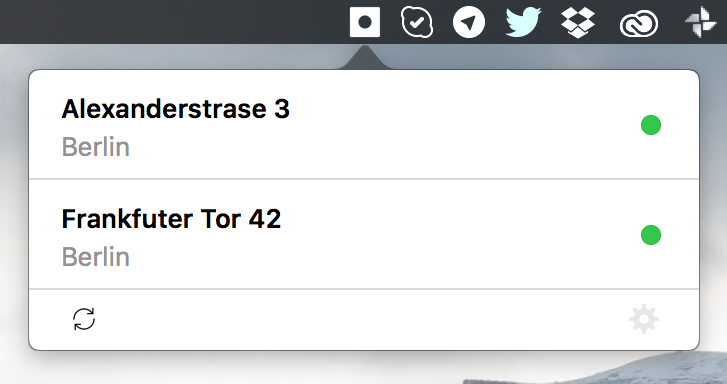

# KIWI Doors Controller - Mac Menu Bar App (Unofficial)

Control your [KIWI](https://kiwi.ki) integrated doors from your Mac Menu Bar. Written with **Swift 3**.

- [**Download App.zip**](https://github.com/insanoid/KIWI-doors-mac-menu-app/releases/download/v1.0.0/KIWI.zip)
- You can also clone and `pod install` and build the app using `Xcode`.

**Please Note: This is not an official app from [KIWI](https://kiwi.ki). There is no warranty - use it at your peril. The API was reverse engineered from their web version.**

## License

[MIT License](LICENSE) / [Karthikeya Udupa](https://karthikeya.co.uk)
